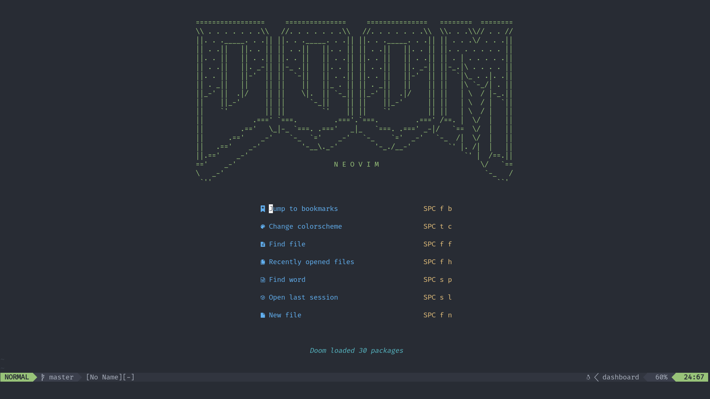

# Doom Neovim



Not really, just kidding. 

I really love [Doom Emacs](https://github.com/hlissner/doom-emacs) and I recommend you to try it. It's the best text editor I tried so far.
But if you want a _vim-like_ editor, well, you'll just use vim right? And you're correct.

That said, you should try [Neovim](https://neovim.io/)

I created these settings to work as I do with Doom Emacs, as far as possible.

### Installation

1. Install neovim `+0.5` with `luajit`.

2. Clone the repo

```sh
git clone https://github.com/arandilopez/doom-neovim ~/.config/nvim
```

3. Clone [Packer](https://github.com/wbthomason/packer.nvim#quickstart)

```sh
git clone --depth 1 https://github.com/wbthomason/packer.nvim\
 ~/.local/share/nvim/site/pack/packer/start/packer.nvim
```

3. Run `nvim`

4. Install packages with `:PackerInstall`
